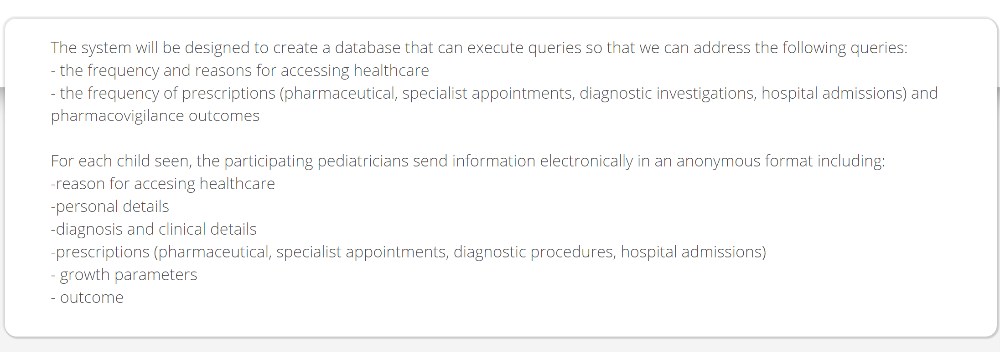
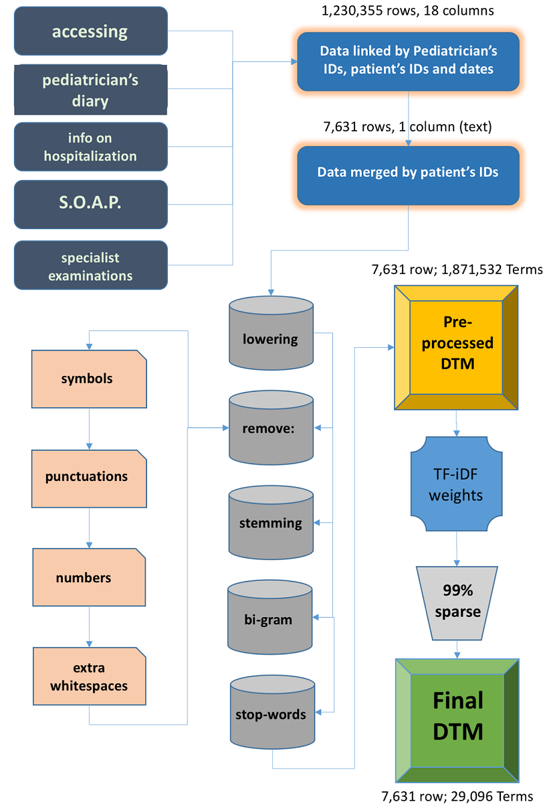

class: center, middle, and title-slide
background-image: url("images/bg.png")
background-position: top
background-size: contain

```{r setup, include=FALSE}
options(htmltools.dir.version = FALSE)
load(here::here("..", "upenn.cl", "limpido", "data", "gold_04_07.rda"))
```

# Machine Learning<br>for<br>Detection of Pediatric Otitis

### **Corrado Lanera**<br><small><small><corrado.lanera@unipd.it></small></small>

University of Padova<br><small>Unit of Biostatistics, Epidemiology, and Public Health<br>Department of Cardiac, Thoracic, Vascular Sciences, and Public Health</small>.

<br>

.left[
  2019/06/20 - HLP Lab @UPenn
]

<br>

.left[
<small>
**Ph. D. candidate**: Specialistic medicine ¨G.B. Morgagni¨<br>
**Topic**: Development and application of Machine Learning and Phenomapping techniques in Clinical Research<br>
**Supervisor**: Prof. Dario Gregori
</small>
]


---
class: center, inverse, middle

# My research at UBEPH

---

# MLT in clinical environments


### Structured data (AKA _phenomapping_)

  + Statistical analyses for clinical research

  + Clustering patterns for genetic counting data


### Unstructured data

  + Patient kinetic data from wearable devices
    
  + Free-Text mining from electronic medical records


---
class: inverse, middle
# Outline

A brief introduction to 

Experiences at UBEPH on health-related free-text analyses
  1. Case detection of Varicella Zoster Virus infections in Italian children
  1. Extend systematic review searches from literature to registries
  1. Classification of pediatric emergency department discharging notes

The otitis project
  1. Task
  1. Data
  1. Challenges

Machine learning strategy 
  1. Pre-processing
  1. Weights and features definition/selection
  1. Class imbalance and learning algorithms
  1. Training flow
  1. Test
  1. Performance evaluation

---
background-image: url("images/pedianet.png")
background-position: bottom
background-size: 90% 60%


A pediatric general practice research database

- A network of more than 450 family pediatricians distributed throughout Italy (120-130 providing data)

- Data about 100,000 children


<!--  -->
<br>
<br>
<br>
<br>
<br>
<br>
<br>
<br>
<br>
<br>
<br>
<br>
<br>
<div align="right"><small>
[http://pedianet.it/en/general-design](http://pedianet.it/en/general-design)
</small><div align="right">

---
class: center, middle, inverse

# Experiences at UBEPH

---
# \#1 Varicella Zoster (_chickenpox_) detection

.pull-left[


<small><small>
<sup>*</sup>L., Berchialla, Baldi, et.al, _JMIR_ [under review]
</small></small>
]

.pull-right[
- **Train and validation**
  - region: Veneto (IT)
  - patients: 7,631
  - records: 1,230,355
- **Test**
  - region: Sicilia (IT)
  - patients: 2,347
  - records: 569,926 

- **Learners**<sup>1</sup>

  - LogitBoost (F: 68.5 [59.3–77.7])
  - GLMNet (F: 36.5 [32.2–40.8]) 
  - Maxent (F: 19.1 [17.2–20.9])

<small><sup>1</sup> Performance on the test set reported.</small>
]

???

SOAP = subjective, objective, assessment, and plan

---
class: middle, inverse

# #1 insights 
  - Single occurrence in a lifetime (time-independent)
  - Always test on unseen data in the training set
  - Impact of the pre-processing (most impact from lowering and 2-gram)
  - Value of bootstrap-based learner

---

# \#2 Extend Systematic Review to registries

**Assumption**:
The validity of Systematic Reviews depends on the ability to fully capture the complete body of evidence through searches of many heterogeneous data sources.

<small>_Baudard et al. (2017) “**Impact of Searching Clinical Trial Registries in Systematic Reviews of Pharmaceutical Treatments: Methodological Systematic Review and Reanalysis of Meta-Analyses.**” BMJ 356_</small>

- Increase in the number of patients: **from 10% to 50%**
- Change in summary statistics: **from 0% to 29%**

**Our aim**: to replace complex interfaces for researchers with Text Mining of available textual fields in clinical registries


**Main issue**:
> MLTs are generally biased towards the majority class samples


---
# \#2 Extend Systematic Review to registries

.pull-left[
**Data**<sup>1</sup>
- 14 Systematic Reviews
- **Train** (from PubMed, overall)
  - 72,000 negative
  - 185 positive
- **Test**:
  - 233,609 (from ct.gov)

<small><small>
  <sup>1</sup> Baudard et al. (2017)
</small></small>

**Learners**
  - GLMNet 
  - Support-Vector Machine ( SVM )
  - Random Forests ( RF )
  - $k$-Nearest Neighbor ( $k$-NN )

]

.pull-right[
**Strategies**<sup>2</sup>

- Random Under Sampling ( RUS )
- Random Over Sampling ( ROS )


- 35:65 minority:majority ratio
- 50:50 minority:majority ratio

<small><small>
  <sup>2</sup> Compared with the straight use of full data-set
</small></small>

**Results**<sup>3</sup>
  - Improve: RUS-35:65, ROS-50:50
  - Worsen: $k$-NN (all strategies)
  - Almost neutral: SVM
    - (RUS-50:50 worsened it)
    
]


  
<small><small>
<sup>3</sup> Based on $\Delta$AUC respect to the application on the full data-set w/out dealing with class imbalance
</small></small>

---
background-image: url("images/fig3.png")
background-position: top
background-size: 95% 90%


<br>
<br>
<br>
<br>
<br>
<br>
<br>
<br>
<br>
<br>
<br>
<br>
<br>
<br>
<br>
<br>
<br>
<br>
<br>
<br>
<br>
<br>
<br>
<br>
<br>
<br>
<small><small>
<sup>*</sup> L., Minto, Sharma, et.al _JCE_ (2018-103)
</small></small>


---
class: middle, inverse

# Insights #2
  - SVM could be the first choice for a fast and performing MLT
  - RUS 35:65 can be useful to reduce the time (and the space) gaining AUC
  - Class imbalance strategies drastically worsen $k$-NN models


---
layout: false

# \#3 Diagnoses classification for children

.pull-left[

<small><small>
<sup>*</sup>Lorenzoni, Bressan, L., et.al. _MCRR_ (04/2019)
</small></small>
]

**Data**
  - 1789 ED visits with reported discharge diagnoses (Free-Text) from 9 Nicaraguan hospitals
  - Diagnoses were manually revised and classified by an independent
peer-review group of expert pediatricians

**Learning strategy**
- Bootstrap samples: distribution of results
- Repeated CV: over-fitting control
- Out-Of-Bag ( OOB ) performance: full data used
- RF: 500 trees each forest (to convergence)

**Results**
- Overall accuracy: 0.7831 [0.7792-0.7965]

---
class: middle, inverse

# Insights #3
  - Lemmata extraction (instead of stemming) improve results and interpretation
  - Value of a bootstrap superstructure
    - strong internal validation
    - data-driven, non-parametric confidence intervals
    - complete use of all the labeled data at the disposal


---
class: center, middle, inverse
# Detection and Classification of Otitis from  free-text medical notes

---

# #1 Task

#### Classification of patients' records into six hierarchical classes
  - 0 = not an otitis case
  - 1 = otitis case, not media
      - 2 = otitis media (OM), not acute
        - 3 = acute otitis media (AOM), not recurrent nor with perforation
          - 4 = AOM with perforation
          - 5 = AOM recurrent
          
### Notes:
- Label 4 and label 5 can coexist 
- Label 5 is time-dependent: three OMA events within six months or 4+ OMA events in 12 months
- Label 5: if the pediatrician explicitly reports that OMA is recurrent, the record has to be marked as well despite the timing


---

# #2 Data

During 2018,  team search the DB for AOM treatments.

They searched only from the "primary diagnosis" field:
- ICD-9 codes
- search string

The primary limitation of the study was the impossibility of manually validate the cases, possibly including False Positive or detecting cases reported only in the "diary" field.

For the current project, they have provided us an extraction of the DB after the same search string filtering, on all diagnoses, sign-and-symptoms, and diaries free-text fields. Whatever excluded should be considered labeled 0 (non-otitis).

---
# #2 Data

.pull-left[
- **Textual** variables<sup>1</sup>
  - diagnosis 1-3
  - sign-and-symptoms 1-3
  - diary 1-4
  - prescription 1-8
  - visit descriptions 1-8
  - visit results 1-8

- **Patients**: 4,475

- **Records**
  - 297,373 overall (2004-2017)
  - 4,928 train (2004-2007)
  - 723 dev (2008-2017)
  - 880 test (2008-2017)
]
.pull-right[
- **Structured** variables
  - patient's id (by pediatrician)
  - patient's gender
  - patient's date of birth
  - pediatrician id
  - date and time of the visit

```{r, include = FALSE}
library(tidyverse, quietly = TRUE)
```
```{r, echo=FALSE}
gold_04_07 %>%
  mutate(
    class = factor(class, labels = c("not-otitis", "otitis", "OM", "OMA", "OMA-perf", "OME-rec"))
  ) %>% 
  ggplot(aes(class, fill = class)) +
  geom_bar(show.legend = FALSE) +
  ggtitle("Class distribution in the train data-set") +
  geom_text(stat = 'count', aes(label = ..count..), vjust = -1)
``` 
]

.footnote[<small><small><sup>1</sup> Italian language.</small></small>]

---

# #3 Challenges

- Patients cannot be identified across pediatricians

- Multiple text-style (i.e., different pediatricians): tags? 

- Hierarchical models: sequential multi-stage?

- Possible multi-label classification: parallel independent stages?

- Time-dependent classification: post-process layer?

- All stages are possibly affected by data imbalance


---
class: center, middle, inverse

# Machine learning strategy


---

# #1 Pre-processing

- **Removing**
  - extra white spaces
  - non-words
  - stop-words
  
- **Merging**
  - lowering
  - lemmata extraction

---

# #2 Weights and features def./sel.


.pull-left[
- **Features augmenting**

  - n-gram $(n\in\{1,2\})$

- **Features enrichment** (tags)<sup>*</sup>

  - POS
  - pediatrician id
]
.pull-right[
- **Weighting strategy**

  - TF-iDF
  
  
- **Feature selection**

  - based on the TF-iDF rank
  - 80%-20% Pareto principle
]

<br>
<br>
- **Diagnoses attribution**
  - could be it discovered by augmentation and enrichment only?


.footnote[
<small><small>
<sup>\*</sup> Disclaimer: I have **no** experience about tagging.
</small></small>
]


---

# #3 Class imbalance and learning algorithms

- **Type**

  - RUS 35:65 (first, because it's cheaper)
  
  - none
  
- **Learners**

  - GLMNet (first, _benchmark_)
  
  - SVM 
  
  - RF<sup>*</sup>

.footnote[
<small><small><sup>*</sup>The `ntree` into forests will be always checked to guarantee the predictions are stable.</small></small>
]
---

# #4 Training flow

#### One model (and subset of data) per stage, trained independently

.pull-left[
`1.` **Training phase: identification**
  - 500 bootstrap superstructure
     - test on OOBs
  - parameter selection
     - 10 x each hyper-par<sup>1</sup> 
     - 5 rep of 10-fold cross-validation ( CV )
  - best model selection
  - further evaluations for 100 incremental train subsets<sup>2</sup>
     - learning curve examination

<small><small><sup>1</sup>Randomly chosen.</small></small><br>
<small><small><sup>2</sup>Best model and hyper-par set only. CV excluded.</small></small>
]
.pull-right[
`2.` **Dev phase: tailoring**<sup>2</sup> 
  - bootstrap superstructure on the dev set
     - test on OOBs
  - parameter selection
     - 10 x each hyper-par<sup>3</sup>
     - 5 x 10-fold dev-CV<sup>4</sup>
  - best hyper-pars
  - further evaluation for 100 incremental dev subsets<sup>2</sup>
     - learning curve examination 
  
<small><small><sup>3</sup>Nested around the phase-one best selection.</small></small><br>
<small><small><sup>4</sup>Added to the full training set.</small></small>
]

---
# 5# Test

`3.` **Test phase: final evaluation**:
  - 100 models trained on incremental train+dev subset<sup>*</sup>
  
  - 500 bootstrap estimation on the test set each model
  
  - learning curve examination

.footnote[
<small><small><sup>*</sup>Best algorithm and hyper-par for the dev set.</small></small>
]


---
# #6 Performance evaluation
- Learning curves analyses

  - more data Vs. more flexibility

- Stage-chain performance analyses

  - for each stage from the second to the fourth, compare the performance obtained by the model on _its own gold test set_, i.e., the one consisting of the records corresponding to 100% correct previous stage prediction

  - the $\Delta$ from _own-gold-_ to _chain-_ performances will be examined and reported for future improvement


---
class: center, middle, inverse
# Limitation

Train, dev and test sets distributions are biased from the full  's DB by the search string matching

Direct application of the model to the full  can behave unexpectedly on the search-string-complementary set

---
class: center, middle, inverse
<br>
<br>
<br>
<br>
<br>
<br>
<br>
<br>
<br>
<br>

# Thank you<br> for your attention


<br>
<br>
<br>
<br>
<br>

Slides created via the R package [**xaringan**](https://github.com/yihui/xaringan)<br>powered by [remark.js](https://remarkjs.com), [**knitr**](http://yihui.name/knitr), and [R Markdown](https://rmarkdown.rstudio.com).
